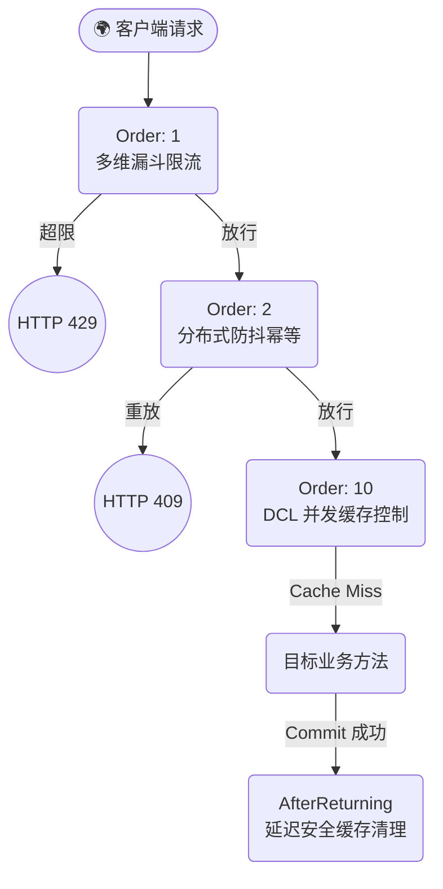

# 🚀 cyforkk-redis-starter


`cyforkk-redis-starter` 是一款基于大厂基础架构（Infra）标准打造的**工业级高可用 Redis 分布式组件**。

它不仅提供了开箱即用的缓存、防抖、限流能力，更在微服务架构的“深水区”（如高并发击穿、分布式竞态条件、网络物理宕机、序列化安全等）构建了严密的防御纵深，致力于在极端复杂的生产环境下保障主核心业务的绝对稳定。

## ✨ 核心架构特性 (Core Features)

- 🛡️ **Fail-Open 柔性降级与刚性阻断**：底层 AOP 自动吞咽 `DataAccessException`，Redis 宕机时自动降级放行（防基础类型拆箱 NPE）。配合 `@NoFallback` 提供高危操作的刚性阻断。
- 🚄 **千万级并发缓存防击穿**：采用 Caffeine 本地缓存弱引用锁池 (`weakValues`) 配合 `ReentrantLock` 构成 DCL 双重检查锁，根除缓存击穿与内存泄漏。
- 🔄 **MVCC 事务感知缓存一致性**：自动探测 Spring 事务，将 `@RedisEvict` 清理动作延迟挂载至事务 `afterCommit` 之后执行，杜绝并发幻读与脏缓存。
- 🔒 **防抖锁防劫持体系**：利用 `UUID` 护城河标记与 `Lua` 脚本验明正身，彻底解决高并发超时场景下的锁误删与劫持灾难。
- 🚦 **多维漏斗限流引擎**：支持 `@RateLimits` 叠加防刷。内置基于本地方法级缓存（L1 Cache）的时间窗口排序算法，彻底消除多维规则下的“脏累加”跨界污染。
- 🛡️ **Jackson 泛型防御 (RCE 免疫)**：基于 `BasicPolymorphicTypeValidator` 白名单机制开启全局多态类型保留，既解决了泛型擦除导致的 `ClassCastException`，又彻底封杀了反序列化 RCE 提权漏洞。

## 📦 快速开始 (Quick Start)

### 1. 引入依赖
在项目的 `pom.xml` 中引入组件（需先执行 `mvn clean install` 安装到本地或私服）：

```xml
<dependency>
    <groupId>com.github.cyforkk</groupId>
    <artifactId>cyforkk-redis-starter</artifactId>
    <version>2.0.0</version>
</dependency>
```

### 2. 全局开关配置 (可选)

在 `application.yml` 中，组件默认处于开启状态。紧急情况下可一键降级：

YAML

```yaml
cyforkk:
  redis:
    enabled: true  # 设为 false 即可彻底休眠组件所有切面
```

------

## 🛠️ 使用指南 (Usage Guide)

### 1. 分布式缓存 (Cache-Aside)

使用 `@RedisCache` 自动处理缓存命中与回源，使用 `@RedisEvict` 清理缓存。**全面支持 SpEL 表达式与动态 `#result` 返回值感知**。

```Java
@Service
public class UserService {

    // 读缓存：缓存未命中时自动查询 DB，并由 DCL 机制防止并发击穿
    @RedisCache(keyPrefix = "user:info:", key = "#id", expireTime = 3600)
    public UserDTO getUser(Long id) {
        return userMapper.selectById(id);
    }

    // 写缓存：支持事务！将在数据库事务 Commit 成功后再清理缓存，绝对防止脏读
    @Transactional
    @RedisEvict(keyPrefix = "user:info:", key = "#result.id")
    public UserDTO saveUser(UserDTO dto) {
        userMapper.insert(dto); // 假设返回自增 ID
        return dto; 
    }
}
```

### 2. 接口幂等性与防抖 (Idempotent)

保护核心接口免受用户表单连点、网络重试及恶意脚本的重放攻击。

```Java
@RestController
public class OrderController {

    // 锁定同一用户 5 秒内只能提交一次订单。业务执行异常时自动安全解锁！
    @Idempotent(keyPrefix = "order:submit:", key = "#req.userId", expireTime = 5, message = "请勿重复提交订单")
    @PostMapping("/submit")
    public Result<String> submitOrder(@RequestBody OrderReq req) {
        orderService.doSubmit(req);
        return Result.success("下单成功");
    }
}
```

### 3. 多维路由限流 (Rate Limit)

支持基于 IP 或动态 SpEL 业务标识的精准限流。底层采用 `Class:Method:IP/SpEL:Time` 构建绝对物理隔离的命名空间，杜绝路由击穿。

```Java
@RestController
public class ActivityController {

    // 多级防刷漏斗：同一用户，1秒内最多点赞 5 次（防爆破），1天内最多点赞 100 次（防爬虫）
    @RateLimits({
        @RateLimit(type = LimitType.CUSTOM, key = "#userId", time = 1, maxCount = 5, message = "操作太快啦，请稍后再试"),
        @RateLimit(type = LimitType.CUSTOM, key = "#userId", time = 86400, maxCount = 100, message = "今日点赞次数已达上限")
    })
    @GetMapping("/like")
    public Result<Void> like(Long userId) {
        return Result.success();
    }
    
    // 全局 IP 限流：同一个真实客户端 IP，10秒内最多调用 3 次
    @RateLimit(type = LimitType.IP, time = 10, maxCount = 3)
    @GetMapping("/public/data")
    public Result<Data> getPublicData() { ... }
}
```

------

## 🏗️ 架构拓扑流转 (Architecture Flow)

组件底层的 AOP 流量清洗模型采用了极严密的优先级（Order）编排，确保以最小的代价拦截脏流量：



## 📜 License

MIT License. Copyright (c) 2026 cyforkk.
