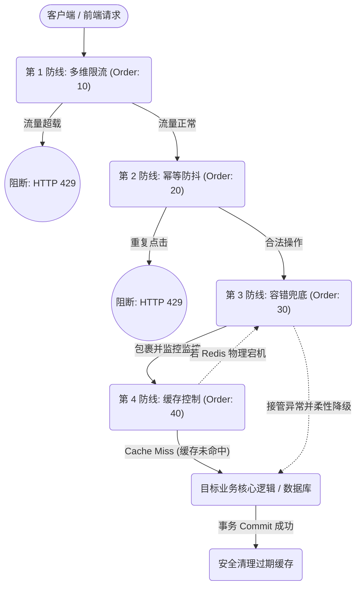

# cyforkk-redis-starter

`cyforkk-redis-starter` 是一款基于大厂基础架构标准打造的工业级高可用 Redis 分布式组件。

在微服务架构中，单纯的读写 Redis 很容易遇到各种“深水区”问题：比如高并发下的缓存击穿、用户手抖导致的重复提交、恶意脚本的疯狂刷量，甚至 Redis 突然宕机导致整个系统雪崩。

本组件将这些复杂的分布式防御逻辑进行了统一封装。你只需要在代码上加几个简单的注解，就能立刻为你的业务系统建立起一道坚不可摧的流量防线。

## 核心能力通俗解析

- **柔性降级（不怕宕机）**：如果 Redis 突然挂了，系统不会跟着崩溃。组件会自动“吞掉”报错，让请求直接去查数据库，保证核心业务（如用户下单）依然可用。
- **防缓存击穿**：当某个热点数据突然过期，如果有 1 万个人同时来查，组件会在内部排队上锁，只放 1 个请求去查数据库并写回 Redis，保护数据库不被瞬间压垮。
- **强一致性保障**：在修改数据时，组件会自动感知 Spring 的数据库事务。只有当数据库真正提交成功后，才会去删除旧缓存，彻底杜绝“脏数据”。
- **防抖与接口幂等**：用户因为网络卡顿疯狂点击“提交”按钮时，组件能在极短时间内精准识别并拦截多余的请求，防止生成重复的订单。
- **多维漏斗限流**：你可以组合配置限流规则。比如：针对单个接口，同一个 IP 10 秒内最多访问 3 次，同时同一个手机号 1 天内最多发送 10 次验证码。
- **高性能全局唯一 ID 生成**：基于 Redis INCR 和 31 位时间戳位运算，提供单机压测破万 QPS 的 64 位纯数字发号器，完美契合 MySQL BIGINT，彻底解决 UUID 无序页分裂和雪花算法时钟回拨问题。
- **开箱即用的开发者体验**：自带默认的全局异常兜底处理器，拦截恶意请求后直接返回规范的 HTTP 429 提示，避免页面出现难看的 500 报错堆栈。

------

## 快速开始

### 1. 引入依赖

将代码拉取到本地并执行 `mvn clean install` 后，在你的 Spring Boot 业务项目中引入依赖：

```XML
<dependency>
    <groupId>com.github.cyforkk</groupId>
    <artifactId>cyforkk-redis-starter</artifactId>
    <version>2.1.0</version>
</dependency>
```

### 2. 全局开关与发号器配置 (可选)

组件引入后默认激活。你可以通过修改 `application.yml` 进行动态配置：

```YAML
cyforkk:
  redis:
    enabled: true  # 设为 false 即可彻底休眠组件所有切面
    id-generator:
      epoch-start: 1704067200 # 分布式发号器纪元起点（秒级时间戳）。强烈建议修改为您项目上线的年份，以最大化时间戳容量
```

> **最佳实践**：不知道怎么计算业务上线时间的时间戳？请直接在你的代码中调用并打印 `CyforkkRedisProperties.IdGenerator.getEpochSecondByString("2026-01-01 00:00:00")`，将获取到的纯数字复制填入上述 YAML 即可。

------

## 业务场景使用指南

### 场景一：查询与修改数据 (分布式缓存)

**业务痛点**：自己手写 Redis 的 `get` 和 `set` 代码繁琐，且容易出现并发一致性问题。

**解决方案**：使用 `@RedisCache` 和 `@RedisEvict`。

```Java
@Service
public class ShopService {

    // 【查数据】：如果 Redis 有，直接返回；如果没有，查数据库并自动放入 Redis。
    // 过期时间设为 10 分钟。自带防击穿保护。
    @RedisCache(keyPrefix = "shop:detail:", key = "#id", expireTime = 600)
    public ShopDTO getShopDetail(Long id) {
        return databaseMapper.selectById(id);
    }

    // 【改数据】：开启事务。数据库更新成功后，自动清理对应的 Redis 缓存。
    @Transactional
    @RedisEvict(keyPrefix = "shop:detail:", key = "#shop.id")
    public void updateShop(ShopDTO shop) {
        databaseMapper.update(shop); 
    }
}
```

### 场景二：防止表单重复提交 (接口幂等与防抖)

**业务痛点**：用户点击“支付”按钮时网络卡了，连点了三下，导致扣了三次钱。

**解决方案**：使用 `@Idempotent`。

```Java
@RestController
public class OrderController {

    // 锁定规则：同一个 userId，在 5 秒内绝对不允许执行第二次。
    // 拦截后会自动抛出异常，前端会收到 429 状态码和 message 提示。
    @Idempotent(keyPrefix = "order:submit:", key = "#req.userId", expireTime = 5, message = "订单处理中，请勿重复点击")
    @PostMapping("/submit")
    public Result submitOrder(@RequestBody OrderReq req) {
        orderService.createOrder(req);
        return Result.success("下单成功");
    }
}
```

### 场景三：防止接口被恶意刷量 (多维限流)

**业务痛点**：竞争对手写了脚本，疯狂调用我们的“发送短信验证码”接口，导致短信费用爆炸。

**解决方案**：使用 `@RateLimit` 组合策略。

```Java
@RestController
public class SmsController {

    // 组合防御网：
    // 第一层：同一个手机号，60 秒内只能发 1 次（防恶意刷某一个号）。
    // 第二层：同一个网络 IP，10 秒内最多请求 5 次（防机器批量刷多个号）。
    @RateLimits({
        @RateLimit(type = LimitType.CUSTOM, key = "#phone", time = 60, maxCount = 1, message = "验证码发送频繁，请 1 分钟后再试"),
        @RateLimit(type = LimitType.IP, time = 10, maxCount = 5, message = "当前网络请求异常，请稍后再试")
    })
    @GetMapping("/sendSms")
    public Result sendSms(@RequestParam String phone) {
        smsService.send(phone);
        return Result.success("发送成功");
    }
}
```

### 场景四：生成全局唯一 ID (分布式发号器)

**业务痛点**：UUID 导致数据库插入慢，雪花算法依赖机器时钟容易发生时钟回拨导致 ID 重复。

**解决方案**：直接注入使用 `CyforkkIdGenerator`。

```Java
@Service
public class OrderService {

    @Autowired
    private CyforkkIdGenerator idGenerator;

    public void createOrder(OrderReq req) {
        // 极速获取 64 位纯数字高性能 ID，对 DB 极其友好
        long orderId = idGenerator.nextId("order"); 
        
        Order order = new Order();
        order.setId(orderId); 
        databaseMapper.insert(order); 
    }
}
```

------

## 架构集成契约 (异常处理推荐)

本组件在触发防抖或限流时，会抛出 `IdempotentException` 或 `RateLimitException`。组件内部已经提供了保底的错误响应机制。

为了让报错信息（JSON 格式）完全符合你所在公司的规范，**强烈建议**在你的业务系统中，配置全局异常处理器接管这些异常：

```Java
@RestControllerAdvice
@Order(Ordered.HIGHEST_PRECEDENCE) // 声明最高控制权，确保覆盖组件的兜底逻辑
public class GlobalExceptionHandler {

    @ExceptionHandler(IdempotentException.class)
    public Result handleIdempotent(IdempotentException e) {
        // 返回贵公司统一的 Result 格式
        return Result.fail(e.getMessage()); 
    }

    @ExceptionHandler(RateLimitException.class)
    public Result handleRateLimit(RateLimitException e) {
        return Result.fail(e.getMessage()); 
    }
}
```

------

## AOP 架构防卫纵深拓扑

组件底层的 AOP 流量清洗模型采用了严格的优先级（Order）编排，确保异常流量在最外围被拦截，而容错机制能完美包裹住缓存机制：

代码段



## License

MIT License. Copyright (c) 2026 cyforkk.
